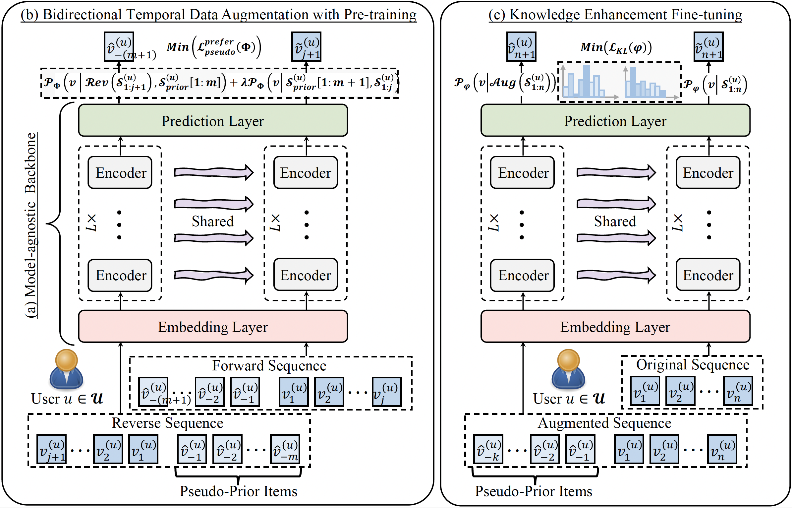

# BARec: Improving Sequential Recommendations via Bidirectional Temporal Data Augmentation with Pre-training

## Overview

<p align="center">
  
  <br>
  <b>Figure 1.</b> The architecture of our proposed BARec framework.
</p>

## Environment

```bash
conda create -n barec python=3.8.8
conda activate barec

pip install torch==1.8.1+cu111 torchvision==0.9.1+cu111 torchaudio==0.8.1 -f https://download.pytorch.org/whl/torch_stable.html
pip install nvidia-tensorflow==1.15.5+nv21.07 
# In case, it raises the `ERROR: Could not find a version that satisfies the requirement absl-py>=0.9.0 (from nvidia-tensorflow) (from versions: none)`.
# Please add the following indexes URL to your `/home/john/.config/pip/pip.conf`
```bash
[global]
no-cache-dir = true
index-url = https://pypi.org/simple
extra-index-url =
                  https://pypi.ngc.nvidia.com
trusted-host =
               pypi.ngc.nvidia.com
```

pip install protobuf==3.15.8
pip install tqdm==4.58.0
pip install scikit-learn==0.24.1
pip install numpy==1.18.5
pip install scipy==1.4.1
```

## Datasets Preparation
**Benchmarks**: Amazon Review datasets Beauty, Movie Lens and Cell_Phones_and_Accessories. 
The data split is done in the `leave-one-out` setting. Make sure you download the datasets from the [link](https://cseweb.ucsd.edu/~jmcauley/datasets/amazon/links.html). Please, use the `DataProcessing.py` under the `data/`, and make sure you change the DATASET variable value to your dataset name, then you run:

```
python DataProcessing.py
```

## Pre-training & Fine-tuning
### Amazon Beauty 
* Reversely model pre-training and short sequence augmentation with generated pseudo-prior items
    ```
    python -u main.py --dataset=Beauty \
                    --lr=0.001 --maxlen=100 --dropout_rate=0.7 --evalnegsample=100 \
                    --hidden_units=128 --num_blocks=2 --num_heads=4 \
                    --reversed=1 --reversed_gen_num=20 --M=20 \
                    --lambda_coef=0.4 \
                    2>&1 | tee pre_train_beauty.log   
    ```
* Fine-tuning reversed pre-trained model with augmented sequential dataset for sequential recommendation
    ```
    python -u main.py --dataset=Beauty \
                    --lr=0.001 --maxlen=100 --dropout_rate=0.7 --evalnegsample=100 \
                    --hidden_units=128 --num_blocks=2 --num_heads=4 \
                    --reversed_pretrain=1 --aug_traindata=15 --M=18 \
                    --alpha_coef=1.0 --clip_k=12 \
                    2>&1 | tee fine_tune_beauty.log
    ```

### Amazon Cell_Phones_and_Accessories
* Reversely model pre-training and short sequence augmentation with generated pseudo-prior items
    ```
    python -u main.py --dataset=Cell_Phones_and_Accessories \
                    --lr=0.001 --maxlen=100 --dropout_rate=0.5 --evalnegsample=100 \
                    --hidden_units=32 --num_blocks=2 --num_heads=2 \
                    --reversed=1 --reversed_gen_num=20 --M=20 \
                    --lambda_coef=0.3 \
                    2>&1 | tee pre_train_phones.log
    ```
* Fine-tuning reversed pre-trained model with augmented sequential dataset for sequential recommendation
    ```
    python -u main.py --dataset=Cell_Phones_and_Accessories \
                    --lr=0.001 --maxlen=100 --dropout_rate=0.5 --evalnegsample=100 \
                    --hidden_units=32 --num_blocks=2 --num_heads=2 \
                    --reversed_pretrain=1 --aug_traindata=17 --M=18 \
                    --alpha_coef=0.2 --clip_k=12 \
                    2>&1 | tee fine_tune_phones.log
    ```

### Shell Command
To simplify the process, you can run the following command:

```bash
sh run_pre_training.sh 
sh run_fine_tuning.sh
```

## Citation
If you use the data or code in this repo, please cite the repo.

```
@misc{jiang2024improvingsequentialrecommendationsbidirectional,
      title={Improving Sequential Recommendations via Bidirectional Temporal Data Augmentation with Pre-training}, 
      author={Juyong Jiang and Peiyan Zhang and Yingtao Luo and Chaozhuo Li and Jaeboum Kim and Kai Zhang and Senzhang Wang and Sunghun Kim},
      year={2024},
      eprint={2112.06460},
      archivePrefix={arXiv},
      primaryClass={cs.IR},
      url={https://arxiv.org/abs/2112.06460}, 
}
```
